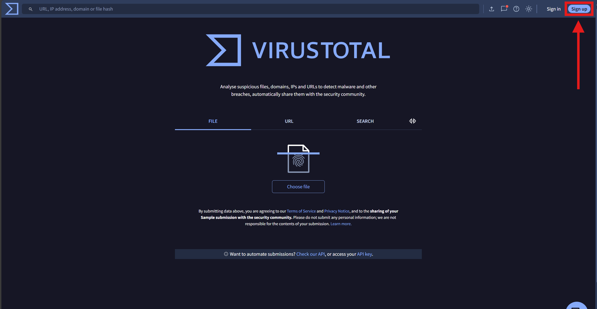
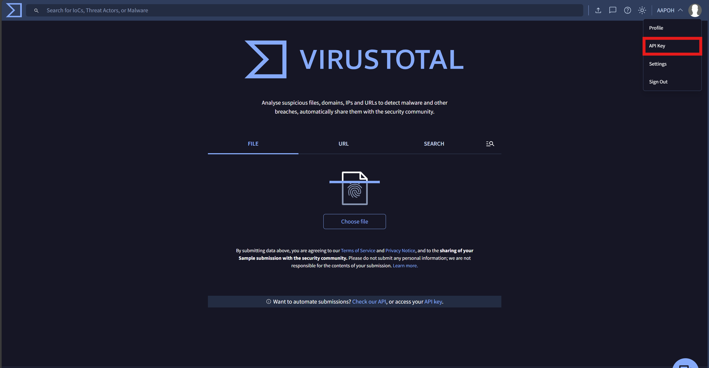
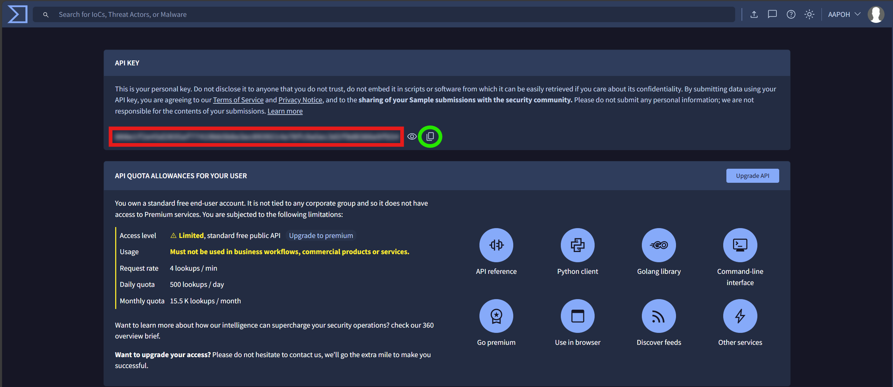

# 🛠️ VirusTotal Adapter Installation Guide

**Step-by-step instructions for installing the application**

---

### ‼️ Note: During installation, you’ll be asked to enter your VirusTotal API key. To jump directly to the API key setup instructions, click [here](#-api-key-setup)

---

## 💾 Installation

1. Download the installer: `VirusTotalAdapterSetup.exe`  
    
2. Launch the installer
3. Choose the installation path (by default — `Program Files (x86)`)
4. Wait until the installation completes
5. On the next screen, enter your VirusTotal API key
6. Done — the application is installed and ready to use!

## 🔑 API Key Setup

1. Go to the [VirusTotal homepage](https://www.virustotal.com/gui/home/upload)
2. Register or log in to your account  
   

3. On the homepage, click your account name in the top-right corner and choose **API Key**  
   

4. On the API Key page, copy the value shown in the **API Key** field  
   

## 🔧 Manually updating the API Key

**If you need to change your API key after installation, follow these steps:**

1. On the Windows taskbar, search for `Edit environment variables for your account`
2. In the opened window, click the **Environment Variables...** button at the bottom
3. In the "User variables for <user_name>" section, find the row named `VIRUS_TOTAL_API_KEY`, select it, click **`Edit...`** below the table and enter the new API key value

> ⚠️ Important: Do **not** change the **`variable name`**, or the application will no longer be able to retrieve your API key.

## 💡 Tips

- 🔒 Never share your API key publicly — it’s tied to your personal account
